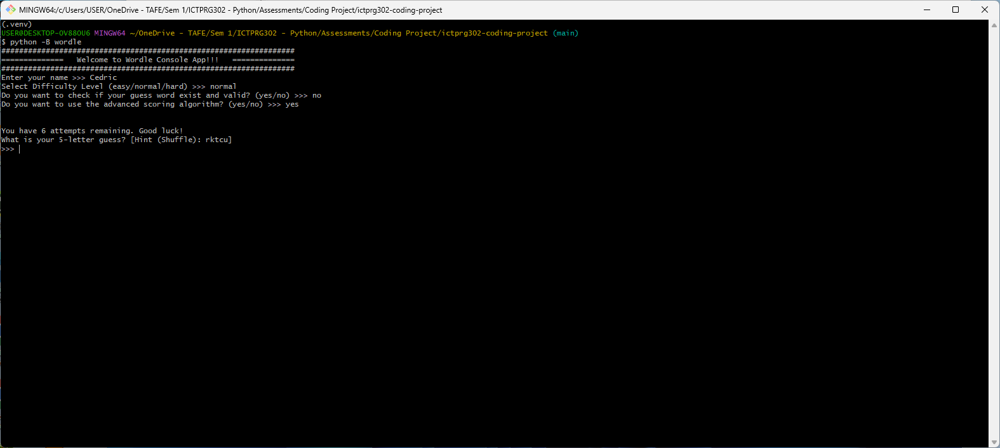
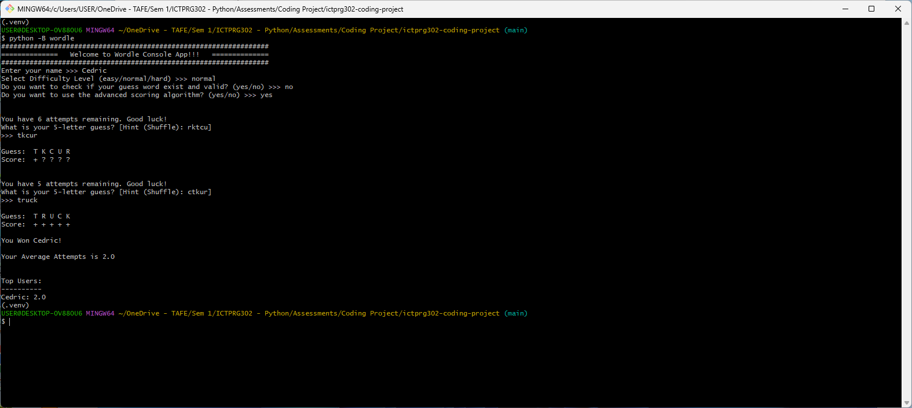

# Command-line Wordle Game

## How to Install and Run
1. Make sure you have Python 3.10+ installed in your machine.
2. `git clone https://github.com/ca20110820/ictprg302-coding-project.git`
3. `cd ictprg302-coding-project/`
4. `python -m venv venv`
5. Activate `venv`
6. `pip install -e .`
7. Run `python wordle`

If you are using Python 3.11+, you may get `ModuleNotFoundError` for `pkg_resources`. 
To fix this issue, try
```bash
python ensure_setuptools.py
```

## Screenshots




